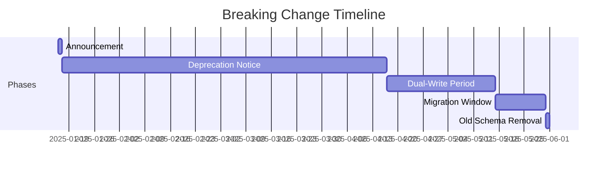
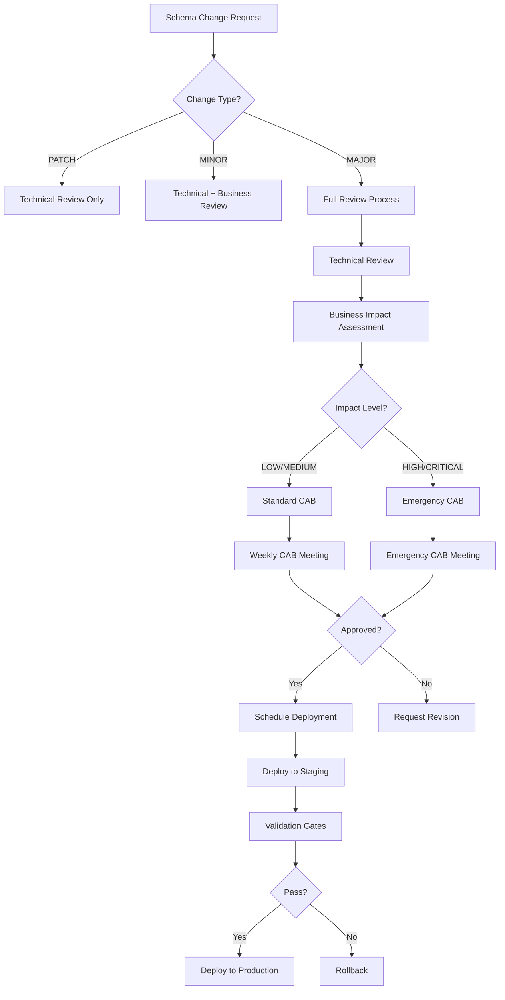
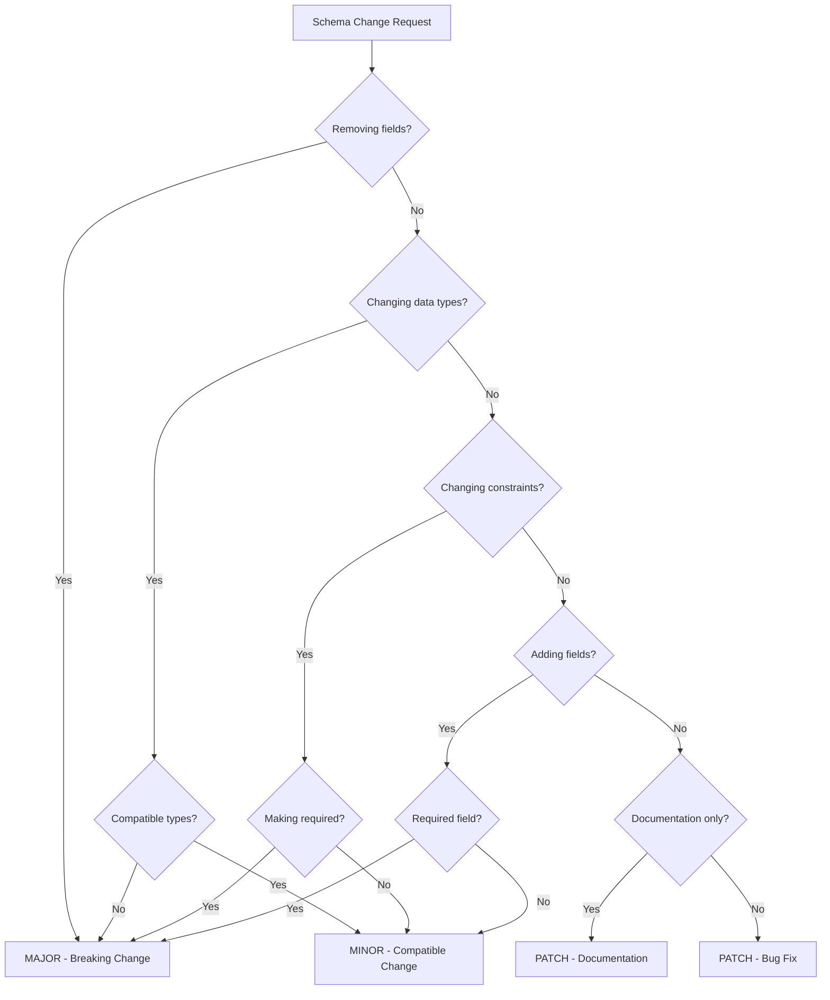
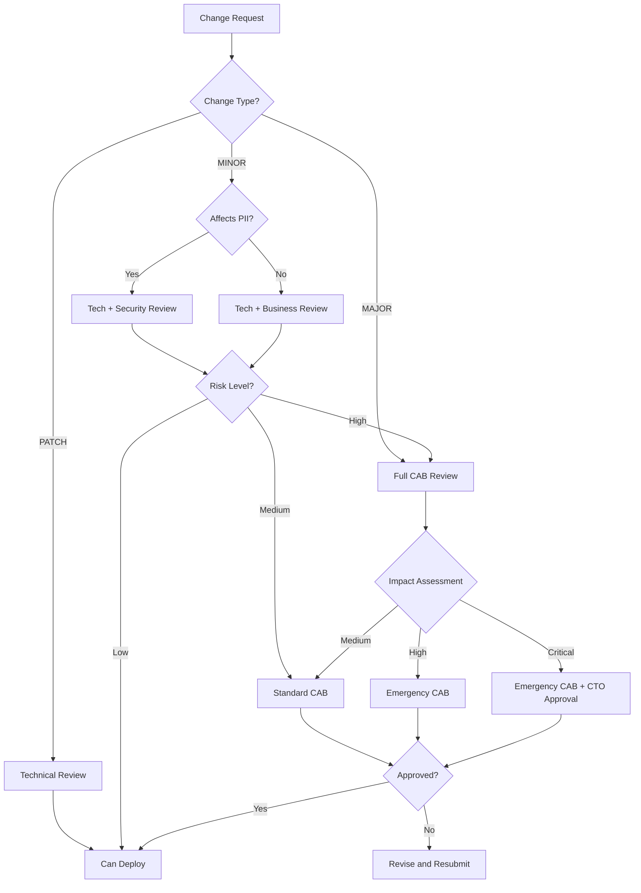
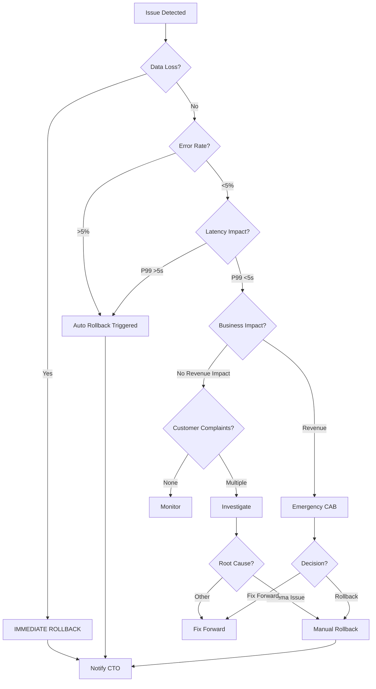

# S3: Schema Change Management Policy
**Version:** 1.0.0
**Effective Date:** 2025-01-16
**Classification:** Schema Governance
**Compliance:** SOC 2 Type II, GDPR Article 25

## 1. Schema Versioning Strategy

### 1.1 Semantic Versioning Format
```
MAJOR.MINOR.PATCH (e.g., 2.4.1)
```

- **MAJOR**: Breaking changes requiring consumer updates
- **MINOR**: Backward-compatible additions
- **PATCH**: Bug fixes, documentation updates, performance optimizations

### 1.2 Version Tracking Implementation

```sql
-- Table metadata tracking
CREATE TABLE schema_versions (
    table_name STRING NOT NULL,
    version STRING NOT NULL,
    deployed_at TIMESTAMP NOT NULL,
    deployed_by STRING NOT NULL,
    change_type STRING NOT NULL,  -- 'MAJOR', 'MINOR', 'PATCH'
    description STRING,
    rollback_version STRING,
    is_active BOOLEAN DEFAULT true,
    PRIMARY KEY (table_name, version)
);

-- Table options for version tracking
ALTER TABLE diagnosticpro_prod.users
SET OPTIONS (
    description = "User management table v2.1.3",
    labels = [("version", "2.1.3"), ("last_modified", "2025-01-16")]
);
```

### 1.3 Compatibility Matrix

| Source Version | Target Version | Compatibility | Migration Required |
|---------------|---------------|---------------|-------------------|
| 1.x.x | 1.y.z (y>x) | ✅ Full | No |
| 1.x.x | 1.x.z (z>x) | ✅ Full | No |
| 1.x.x | 2.0.0 | ⚠️ Partial | Yes - Breaking |
| 2.x.x | 1.x.x | ❌ None | Downgrade script |

## 2. Change Categories and Definitions

### 2.1 Breaking Changes (MAJOR Version)
**Requirement:** 90-day deprecation notice

Examples:
- Removing columns
- Changing column data types (incompatible)
- Renaming tables or columns
- Changing primary key structure
- Modifying REQUIRED constraints

```json
{
  "change_type": "BREAKING",
  "examples": [
    {
      "action": "REMOVE_COLUMN",
      "table": "users",
      "column": "legacy_id",
      "migration_required": true,
      "deprecation_period_days": 90
    },
    {
      "action": "CHANGE_TYPE",
      "table": "diagnostics",
      "column": "error_code",
      "from": "STRING",
      "to": "INT64",
      "migration_required": true
    }
  ]
}
```

### 2.2 Backward-Compatible Additions (MINOR Version)
**Requirement:** No consumer changes needed

Examples:
- Adding nullable columns
- Creating new tables
- Adding indexes
- Creating views
- Adding optional JSON fields

```json
{
  "change_type": "COMPATIBLE",
  "examples": [
    {
      "action": "ADD_COLUMN",
      "table": "equipment",
      "column": "warranty_status",
      "type": "STRING",
      "mode": "NULLABLE",
      "default": null
    },
    {
      "action": "CREATE_TABLE",
      "table": "equipment_telemetry",
      "backward_compatible": true
    }
  ]
}
```

### 2.3 Bug Fixes/Documentation (PATCH Version)
**Requirement:** No structural changes

Examples:
- Fixing constraint definitions
- Updating column descriptions
- Performance optimizations
- Documentation corrections

## 3. Breaking Change Process

### 3.1 Deprecation Timeline


### 3.2 Dual-Write Implementation

```python
# dual_write_manager.py
import logging
from typing import Dict, Any
from datetime import datetime, timedelta

class DualWriteManager:
    def __init__(self, old_schema: str, new_schema: str):
        self.old_schema = old_schema
        self.new_schema = new_schema
        self.start_time = datetime.utcnow()
        self.end_time = self.start_time + timedelta(days=30)

    def write_data(self, data: Dict[str, Any]) -> bool:
        """Write to both old and new schemas during migration"""
        success = True

        # Write to new schema (primary)
        try:
            self.write_new_schema(data)
            logging.info(f"Wrote to new schema: {self.new_schema}")
        except Exception as e:
            logging.error(f"Failed writing to new schema: {e}")
            success = False

        # Write to old schema (compatibility)
        if datetime.utcnow() < self.end_time:
            try:
                transformed_data = self.transform_for_old_schema(data)
                self.write_old_schema(transformed_data)
                logging.info(f"Wrote to old schema: {self.old_schema}")
            except Exception as e:
                logging.warning(f"Failed writing to old schema: {e}")
                # Don't fail the operation if old schema write fails

        return success

    def transform_for_old_schema(self, data: Dict[str, Any]) -> Dict[str, Any]:
        """Transform data to fit old schema format"""
        # Implementation specific to schema changes
        return data
```

### 3.3 Migration Scripts

```bash
#!/bin/bash
# migrate_schema_v2.sh

set -euo pipefail

# Configuration
OLD_VERSION="1.5.2"
NEW_VERSION="2.0.0"
DATASET="diagnosticpro_prod"
TABLE="equipment"
BACKUP_DATASET="diagnosticpro_archive"

echo "Starting migration from v${OLD_VERSION} to v${NEW_VERSION}"

# Step 1: Create backup
echo "Creating backup..."
bq cp ${DATASET}.${TABLE} ${BACKUP_DATASET}.${TABLE}_v${OLD_VERSION}_$(date +%Y%m%d)

# Step 2: Create new table with new schema
echo "Creating new table structure..."
bq mk --table \
  --schema equipment_schema_v2.json \
  --time_partitioning_field created_at \
  ${DATASET}.${TABLE}_v2

# Step 3: Migrate data with transformations
echo "Migrating data..."
bq query --use_legacy_sql=false --destination_table=${DATASET}.${TABLE}_v2 \
"
SELECT
  -- Map old fields to new structure
  id,
  CAST(equipment_id AS STRING) as identification_number,  -- Type change
  make as manufacturer,  -- Rename
  model,
  year,
  -- New required field with default
  IFNULL(category, 'UNKNOWN') as equipment_category,
  created_at,
  updated_at
FROM ${DATASET}.${TABLE}
"

# Step 4: Validate migration
echo "Validating migration..."
OLD_COUNT=$(bq query --use_legacy_sql=false --format=csv \
  "SELECT COUNT(*) FROM ${DATASET}.${TABLE}" | tail -1)
NEW_COUNT=$(bq query --use_legacy_sql=false --format=csv \
  "SELECT COUNT(*) FROM ${DATASET}.${TABLE}_v2" | tail -1)

if [[ "$OLD_COUNT" != "$NEW_COUNT" ]]; then
  echo "ERROR: Row count mismatch! Old: $OLD_COUNT, New: $NEW_COUNT"
  exit 1
fi

echo "Migration completed successfully"
```

### 3.4 Rollback Procedures

```python
# rollback_manager.py
import json
from datetime import datetime
from google.cloud import bigquery

class SchemaRollback:
    def __init__(self, project_id: str, dataset_id: str):
        self.client = bigquery.Client(project=project_id)
        self.dataset_id = dataset_id

    def create_rollback_point(self, table_name: str, version: str):
        """Create a rollback point before schema change"""
        timestamp = datetime.utcnow().strftime('%Y%m%d_%H%M%S')
        backup_table = f"{table_name}_rollback_{version}_{timestamp}"

        # Copy current table
        source = f"{self.dataset_id}.{table_name}"
        destination = f"{self.dataset_id}_archive.{backup_table}"

        job = self.client.copy_table(source, destination)
        job.result()

        # Store rollback metadata
        rollback_info = {
            "table": table_name,
            "version": version,
            "backup_table": backup_table,
            "created_at": timestamp,
            "source": source,
            "destination": destination
        }

        with open(f"rollbacks/{table_name}_{version}.json", "w") as f:
            json.dump(rollback_info, f)

        return backup_table

    def execute_rollback(self, table_name: str, target_version: str):
        """Rollback to a specific version"""
        rollback_file = f"rollbacks/{table_name}_{target_version}.json"

        with open(rollback_file, "r") as f:
            rollback_info = json.load(f)

        # Rename current table
        current_table = f"{self.dataset_id}.{table_name}"
        failed_table = f"{self.dataset_id}.{table_name}_failed_{datetime.utcnow().strftime('%Y%m%d')}"

        # Move failed version
        self.client.copy_table(current_table, failed_table)
        self.client.delete_table(current_table)

        # Restore from backup
        backup_source = rollback_info["destination"]
        self.client.copy_table(backup_source, current_table)

        print(f"Rolled back {table_name} to version {target_version}")
        return True
```

## 4. Validation Gates

### 4.1 Pre-Deployment Validation

```python
# schema_validator.py
import json
import jsonschema
from typing import Dict, List, Tuple

class SchemaValidator:
    def __init__(self, schema_file: str):
        with open(schema_file, 'r') as f:
            self.schema = json.load(f)

    def validate_compatibility(self, old_schema: Dict, new_schema: Dict) -> Tuple[bool, List[str]]:
        """Check if new schema is backward compatible"""
        issues = []

        # Check for removed required fields
        old_required = set(old_schema.get('required', []))
        new_required = set(new_schema.get('required', []))

        removed_required = old_required - new_required
        if removed_required:
            issues.append(f"Breaking: Removed required fields: {removed_required}")

        # Check for type changes
        old_props = old_schema.get('properties', {})
        new_props = new_schema.get('properties', {})

        for field, old_def in old_props.items():
            if field in new_props:
                new_def = new_props[field]
                if old_def.get('type') != new_def.get('type'):
                    issues.append(f"Breaking: Type change for {field}: {old_def['type']} -> {new_def['type']}")

        # Check for removed fields
        removed_fields = set(old_props.keys()) - set(new_props.keys())
        if removed_fields:
            issues.append(f"Breaking: Removed fields: {removed_fields}")

        is_compatible = len(issues) == 0
        return is_compatible, issues
```

### 4.2 Post-Deployment Validation

```sql
-- constraint_checks.sql
-- Verify data integrity after schema change

-- Check for NULL values in required fields
SELECT
  'NULL_CHECK' as check_type,
  COUNT(*) as violation_count
FROM diagnosticpro_prod.equipment
WHERE identification_number IS NULL
  OR manufacturer IS NULL
  OR equipment_category IS NULL;

-- Check referential integrity
SELECT
  'FK_CHECK' as check_type,
  COUNT(*) as violation_count
FROM diagnosticpro_prod.diagnostics d
LEFT JOIN diagnosticpro_prod.equipment e
  ON d.equipment_id = e.id
WHERE e.id IS NULL;

-- Check data type constraints
SELECT
  'TYPE_CHECK' as check_type,
  COUNT(*) as violation_count
FROM diagnosticpro_prod.diagnostics
WHERE NOT REGEXP_CONTAINS(dtc_code, r'^[PBCU]\d{4}$');
```

### 4.3 Performance Benchmarks

```python
# performance_validator.py
import time
from typing import Dict
from google.cloud import bigquery

class PerformanceValidator:
    def __init__(self, client: bigquery.Client):
        self.client = client
        self.thresholds = {
            'simple_query': 2.0,  # seconds
            'complex_join': 10.0,
            'aggregation': 5.0,
            'full_scan': 30.0
        }

    def benchmark_schema_change(self, dataset: str, table: str) -> Dict[str, float]:
        """Run performance benchmarks after schema change"""
        results = {}

        # Simple query
        start = time.time()
        query = f"SELECT * FROM `{dataset}.{table}` LIMIT 1000"
        self.client.query(query).result()
        results['simple_query'] = time.time() - start

        # Complex join
        start = time.time()
        query = f"""
        SELECT e.*, d.dtc_code, d.description
        FROM `{dataset}.{table}` e
        JOIN `{dataset}.diagnostics` d ON e.id = d.equipment_id
        LIMIT 1000
        """
        self.client.query(query).result()
        results['complex_join'] = time.time() - start

        # Validate against thresholds
        for metric, duration in results.items():
            if duration > self.thresholds.get(metric, float('inf')):
                raise ValueError(f"Performance degradation: {metric} took {duration}s")

        return results
```

## 5. Approval Workflow

### 5.1 Review Requirements by Change Type

| Change Type | Technical Review | Business Review | Security Review | CAB Approval |
|------------|-----------------|-----------------|-----------------|--------------|
| PATCH | Required | Optional | Optional | Not Required |
| MINOR | Required | Required | Conditional* | Not Required |
| MAJOR | Required | Required | Required | Required |

*Conditional: Required if changes involve PII or sensitive data

### 5.2 Technical Review Checklist

```yaml
technical_review:
  schema_architect:
    - validate_json_schema: true
    - check_naming_conventions: true
    - verify_data_types: true
    - assess_index_impact: true
    - review_partitioning: true
    - check_clustering: true

  validation_gates:
    - json_schema_validation: PASS
    - sql_syntax_check: PASS
    - compatibility_check: PASS
    - performance_benchmark: PASS

  documentation:
    - migration_guide: PROVIDED
    - rollback_procedure: DOCUMENTED
    - api_changes: LISTED
```

### 5.3 Business Impact Assessment

```python
# impact_assessment.py
from enum import Enum
from typing import List, Dict

class ImpactLevel(Enum):
    LOW = "low"
    MEDIUM = "medium"
    HIGH = "high"
    CRITICAL = "critical"

class BusinessImpactAssessment:
    def __init__(self):
        self.criteria = {
            'downtime_required': False,
            'api_changes': False,
            'consumer_changes_required': False,
            'data_migration_required': False,
            'revenue_impact': False
        }

    def assess_impact(self, change_request: Dict) -> ImpactLevel:
        """Assess business impact of schema change"""
        score = 0

        # Breaking changes are automatically HIGH or CRITICAL
        if change_request['change_type'] == 'MAJOR':
            score += 3

        # Check each criterion
        if change_request.get('downtime_required'):
            score += 2
        if change_request.get('consumer_changes_required'):
            score += 2
        if change_request.get('revenue_impact'):
            score += 3
        if change_request.get('data_migration_required'):
            score += 1

        # Determine impact level
        if score >= 7:
            return ImpactLevel.CRITICAL
        elif score >= 4:
            return ImpactLevel.HIGH
        elif score >= 2:
            return ImpactLevel.MEDIUM
        else:
            return ImpactLevel.LOW
```

### 5.4 Security Review Requirements

```yaml
security_review:
  pii_changes:
    - check_encryption: true
    - verify_access_controls: true
    - audit_logging: true
    - gdpr_compliance: true

  data_classification:
    - public: NO_REVIEW
    - internal: STANDARD_REVIEW
    - confidential: ENHANCED_REVIEW
    - restricted: FULL_REVIEW

  compliance_checks:
    - soc2_type2: true
    - gdpr_article_25: true
    - data_retention: true
    - right_to_erasure: true
```

### 5.5 Change Advisory Board (CAB) Process



## 6. Rollback Strategy

### 6.1 Automated Rollback Triggers

```python
# auto_rollback.py
import logging
from datetime import datetime, timedelta
from typing import Dict, List

class AutoRollbackManager:
    def __init__(self):
        self.triggers = {
            'error_rate': 0.05,  # 5% error threshold
            'latency_p99': 5000,  # 5 second p99
            'availability': 0.995,  # 99.5% availability
            'data_loss': 0  # Zero tolerance
        }

    def monitor_deployment(self, deployment_id: str) -> bool:
        """Monitor deployment and trigger rollback if needed"""
        metrics = self.collect_metrics(deployment_id)

        for metric, threshold in self.triggers.items():
            current_value = metrics.get(metric, 0)

            if metric == 'availability':
                if current_value < threshold:
                    logging.error(f"Rollback triggered: {metric}={current_value}")
                    return self.trigger_rollback(deployment_id)
            else:
                if current_value > threshold:
                    logging.error(f"Rollback triggered: {metric}={current_value}")
                    return self.trigger_rollback(deployment_id)

        return True  # No rollback needed

    def trigger_rollback(self, deployment_id: str) -> bool:
        """Execute automatic rollback"""
        logging.critical(f"AUTOMATIC ROLLBACK INITIATED for {deployment_id}")

        # Step 1: Stop writes to new schema
        self.stop_writes()

        # Step 2: Restore from backup
        self.restore_backup(deployment_id)

        # Step 3: Redirect traffic
        self.redirect_traffic_to_old_schema()

        # Step 4: Alert stakeholders
        self.send_rollback_alerts(deployment_id)

        return True
```

### 6.2 Manual Rollback Procedures

```bash
#!/bin/bash
# manual_rollback.sh

# Usage: ./manual_rollback.sh <table_name> <target_version>

TABLE_NAME=$1
TARGET_VERSION=$2
DATASET="diagnosticpro_prod"
ARCHIVE_DATASET="diagnosticpro_archive"

echo "=== MANUAL ROLLBACK PROCEDURE ==="
echo "Table: $TABLE_NAME"
echo "Target Version: $TARGET_VERSION"
echo ""

# Step 1: Confirm rollback
read -p "Are you sure you want to rollback? (yes/no): " CONFIRM
if [[ $CONFIRM != "yes" ]]; then
    echo "Rollback cancelled"
    exit 0
fi

# Step 2: Stop application writes
echo "Stopping application writes..."
kubectl scale deployment diagnostic-api --replicas=0

# Step 3: Create safety backup of current state
echo "Creating safety backup..."
SAFETY_BACKUP="${TABLE_NAME}_safety_$(date +%Y%m%d_%H%M%S)"
bq cp ${DATASET}.${TABLE_NAME} ${ARCHIVE_DATASET}.${SAFETY_BACKUP}

# Step 4: Find rollback point
ROLLBACK_TABLE="${TABLE_NAME}_rollback_${TARGET_VERSION}"
echo "Looking for rollback table: ${ROLLBACK_TABLE}"

# Step 5: Execute rollback
echo "Executing rollback..."
bq rm -f ${DATASET}.${TABLE_NAME}
bq cp ${ARCHIVE_DATASET}.${ROLLBACK_TABLE} ${DATASET}.${TABLE_NAME}

# Step 6: Verify rollback
ROW_COUNT=$(bq query --use_legacy_sql=false --format=csv \
    "SELECT COUNT(*) FROM ${DATASET}.${TABLE_NAME}" | tail -1)
echo "Rollback complete. Table now has ${ROW_COUNT} rows"

# Step 7: Restart application
echo "Restarting application..."
kubectl scale deployment diagnostic-api --replicas=3

echo "=== ROLLBACK COMPLETE ==="
```

### 6.3 Communication Plan

```yaml
rollback_communication:
  immediate_notification:
    - ops_team: PagerDuty alert
    - engineering_lead: SMS + Email
    - product_owner: Email
    - cto: Email

  status_updates:
    - frequency: Every 15 minutes
    - channel: #incident-response
    - format: |
        **Rollback Status Update**
        Time: [timestamp]
        Table: [table_name]
        Status: [IN_PROGRESS/COMPLETE/FAILED]
        Impact: [description]
        ETA: [completion_time]

  post_mortem:
    - timeline: Within 48 hours
    - participants: Engineering, Product, Operations
    - deliverables:
        - Root cause analysis
        - Impact assessment
        - Prevention measures
        - Action items
```

## 7. Documentation Requirements

### 7.1 Migration Guide Template

```markdown
# Migration Guide: [Table Name] v[Old] to v[New]

## Overview
- **Change Type:** [MAJOR/MINOR/PATCH]
- **Deprecation Date:** [Date]
- **Migration Deadline:** [Date]
- **Contact:** [Email]

## Breaking Changes
1. [List all breaking changes]
2. [Include field mappings]

## Migration Steps

### Step 1: Update Client Libraries
```python
# Old code
from diagnostic_sdk import Client
client = Client(version='1.x')

# New code
from diagnostic_sdk import Client
client = Client(version='2.x')
```

### Step 2: Update Queries
```sql
-- Old query
SELECT equipment_id, car_make FROM equipment;

-- New query
SELECT identification_number, manufacturer FROM equipment;
```

### Step 3: Test in Staging
[Instructions for testing]

## Rollback Instructions
[How to rollback if issues occur]

## Support
- Slack: #schema-migration
- Email: schema-team@diagnosticpro.com
```

### 7.2 API Changelog Format

```markdown
# API Changelog

## [2.0.0] - 2025-01-16

### Breaking Changes
- **equipment table**: Renamed `car_make` to `manufacturer`
- **equipment table**: Changed `equipment_id` type from INT64 to STRING
- **diagnostics table**: Made `dtc_code` field required

### Added
- **equipment table**: New field `warranty_status` (nullable)
- **New table**: `equipment_telemetry` for IoT data

### Deprecated
- **users table**: Field `legacy_id` will be removed in v3.0.0

### Migration Notes
See [Migration Guide v2.0.0](./migrations/v2.0.0.md)
```

### 7.3 Consumer Notification Template

```python
# notification_manager.py
from typing import List, Dict
import smtplib
from email.mime.text import MIMEText
from datetime import datetime, timedelta

class SchemaChangeNotification:
    def __init__(self):
        self.template = """
        Subject: [ACTION REQUIRED] Schema Change Notice - {table_name}

        Dear API Consumer,

        We are announcing a {change_type} change to the {table_name} table.

        **Change Summary:**
        {change_summary}

        **Important Dates:**
        - Announcement: {announcement_date}
        - Deprecation: {deprecation_date}
        - Migration Deadline: {migration_deadline}
        - Old Schema Removal: {removal_date}

        **Required Actions:**
        {required_actions}

        **Resources:**
        - Migration Guide: {migration_guide_url}
        - API Changelog: {changelog_url}
        - Test Environment: {staging_url}

        **Support:**
        - Slack: #schema-migration
        - Email: schema-team@diagnosticpro.com
        - Office Hours: Tuesdays 2-3pm PT

        Please complete your migration before {migration_deadline}.

        Best regards,
        Schema Team
        """

    def send_notification(self, recipients: List[str], change_info: Dict):
        """Send schema change notifications"""
        message = self.template.format(**change_info)

        for recipient in recipients:
            self.send_email(recipient, message)

        # Log notification
        self.log_notification(recipients, change_info)
```

### 7.4 Audit Trail Requirements

```sql
-- audit_trail.sql
CREATE TABLE schema_change_audit (
    audit_id STRING NOT NULL,
    timestamp TIMESTAMP NOT NULL,
    table_name STRING NOT NULL,
    change_type STRING NOT NULL,  -- 'MAJOR', 'MINOR', 'PATCH'
    old_version STRING,
    new_version STRING,
    changed_by STRING NOT NULL,
    approved_by ARRAY<STRING>,
    change_description STRING,
    rollback_performed BOOLEAN DEFAULT false,
    rollback_timestamp TIMESTAMP,
    rollback_reason STRING,
    impact_assessment STRING,
    cab_approval_id STRING,
    deployment_status STRING,  -- 'PENDING', 'DEPLOYED', 'ROLLED_BACK'
    PRIMARY KEY (audit_id)
);

-- Insert audit record for every change
INSERT INTO schema_change_audit VALUES (
    GENERATE_UUID(),
    CURRENT_TIMESTAMP(),
    'equipment',
    'MAJOR',
    '1.5.2',
    '2.0.0',
    'john.doe@diagnosticpro.com',
    ['jane.smith@diagnosticpro.com', 'bob.jones@diagnosticpro.com'],
    'Renamed car_make to manufacturer, changed equipment_id type',
    false,
    NULL,
    NULL,
    'HIGH - Breaking changes affecting 15 consumers',
    'CAB-2025-001',
    'DEPLOYED'
);
```

## 8. Decision Trees

### 8.1 Change Type Decision Tree



### 8.2 Approval Level Decision Tree



### 8.3 Rollback Decision Tree



## 9. Implementation Examples

### 9.1 Example: Adding a Nullable Column (MINOR)

```bash
# Step 1: Create schema change request
cat > change_request.json <<EOF
{
  "table": "equipment",
  "change_type": "MINOR",
  "version": "1.2.0 -> 1.3.0",
  "changes": [{
    "action": "ADD_COLUMN",
    "column": "last_maintenance_date",
    "type": "DATE",
    "mode": "NULLABLE"
  }]
}
EOF

# Step 2: Run validation
python3 schema_validator.py change_request.json

# Step 3: Apply change
bq update \
  --schema equipment_schema_v1.3.0.json \
  diagnosticpro_prod.equipment

# Step 4: Verify
bq show --format=prettyjson diagnosticpro_prod.equipment
```

### 9.2 Example: Renaming a Column (MAJOR)

```python
# rename_column.py
from datetime import datetime, timedelta
import time

class ColumnRenamer:
    def __init__(self, dataset: str, table: str):
        self.dataset = dataset
        self.table = table
        self.deprecation_period = timedelta(days=90)

    def execute_rename(self, old_name: str, new_name: str):
        """Execute column rename with dual-write period"""

        # Phase 1: Add new column
        print(f"Phase 1: Adding new column {new_name}")
        self.add_column(new_name)

        # Phase 2: Dual-write period (30 days)
        print("Phase 2: Starting dual-write period")
        self.start_dual_write(old_name, new_name)

        # Phase 3: Migrate existing data
        print("Phase 3: Migrating existing data")
        self.migrate_data(old_name, new_name)

        # Phase 4: Switch primary to new column
        print("Phase 4: Switching to new column")
        time.sleep(30 * 24 * 3600)  # Wait 30 days

        # Phase 5: Stop writing to old column
        print("Phase 5: Deprecating old column")
        self.deprecate_column(old_name)

        # Phase 6: Remove old column (after 90 days)
        print("Phase 6: Scheduled removal of old column")
        self.schedule_removal(old_name, datetime.now() + self.deprecation_period)
```

### 9.3 Example: Emergency Rollback

```bash
#!/bin/bash
# emergency_rollback.sh

# EMERGENCY ROLLBACK PROCEDURE
# Use only when automated rollback fails

set -e

echo "=== EMERGENCY ROLLBACK INITIATED ==="
echo "Time: $(date)"

# 1. Stop all traffic immediately
echo "Stopping all API traffic..."
kubectl scale deployment diagnostic-api --replicas=0
kubectl scale deployment diagnostic-worker --replicas=0

# 2. Snapshot current state
echo "Creating emergency snapshot..."
SNAPSHOT="emergency_$(date +%Y%m%d_%H%M%S)"
bq extract \
  --destination_format=AVRO \
  diagnosticpro_prod.* \
  gs://diagnostic-backups/${SNAPSHOT}/*.avro

# 3. Restore last known good configuration
echo "Restoring last known good state..."
LAST_GOOD="20250115_production_backup"
bq load \
  --source_format=AVRO \
  --replace \
  diagnosticpro_prod.equipment \
  gs://diagnostic-backups/${LAST_GOOD}/equipment*.avro

# 4. Verify restoration
echo "Verifying restoration..."
TEST_QUERY="SELECT COUNT(*) as count FROM diagnosticpro_prod.equipment"
RESULT=$(bq query --use_legacy_sql=false --format=csv "$TEST_QUERY" | tail -1)
echo "Restored table has $RESULT rows"

# 5. Restart services with old schema
echo "Restarting services..."
kubectl set env deployment/diagnostic-api SCHEMA_VERSION=1.5.2
kubectl scale deployment diagnostic-api --replicas=3
kubectl scale deployment diagnostic-worker --replicas=2

# 6. Send notifications
curl -X POST https://hooks.slack.com/services/XXX/YYY/ZZZ \
  -H 'Content-Type: application/json' \
  -d '{"text":"EMERGENCY ROLLBACK COMPLETED - All hands on deck for post-mortem"}'

echo "=== EMERGENCY ROLLBACK COMPLETE ==="
echo "Next steps:"
echo "1. Verify application functionality"
echo "2. Check monitoring dashboards"
echo "3. Schedule emergency post-mortem"
echo "4. Notify all stakeholders"
```

## 10. Compliance and Governance

### 10.1 Regulatory Compliance Matrix

| Regulation | Requirement | Implementation |
|------------|------------|---------------|
| GDPR Art. 25 | Data Protection by Design | Schema validation includes PII checks |
| GDPR Art. 17 | Right to Erasure | Soft delete with purge procedures |
| SOC 2 Type II | Change Management | Full audit trail and approval workflow |
| HIPAA | Data Integrity | Validation gates and checksums |
| PCI DSS | Secure Development | Security review for payment data |

### 10.2 Schema Governance Board

```yaml
governance_board:
  members:
    - role: Chief Architect
      responsibilities:
        - Final approval for MAJOR changes
        - Architecture compliance
        - Technical debt assessment

    - role: Data Protection Officer
      responsibilities:
        - PII and privacy review
        - GDPR compliance verification
        - Data classification

    - role: Security Lead
      responsibilities:
        - Security impact assessment
        - Access control review
        - Encryption requirements

    - role: Product Owner
      responsibilities:
        - Business impact assessment
        - Customer communication
        - Feature prioritization

  meeting_schedule:
    regular: "Weekly - Thursdays 2pm PT"
    emergency: "On-demand with 1-hour notice"

  decision_authority:
    PATCH: Technical Lead
    MINOR: Architecture Team
    MAJOR: Full Board
    CRITICAL: Board + CTO
```

---

**Document Version:** 1.0.0
**Last Updated:** 2025-01-16
**Next Review:** 2025-04-16
**Owner:** Schema Architecture Team
**Classification:** Internal Use Only

## Appendix A: Quick Reference Commands

```bash
# Check current schema version
bq show --format=prettyjson diagnosticpro_prod.equipment | grep version

# Create backup before change
bq cp diagnosticpro_prod.equipment diagnosticpro_archive.equipment_$(date +%Y%m%d)

# Validate schema file
python3 -m jsonschema -i data.json schema.json

# Run compatibility check
python3 schema_validator.py --old=v1.json --new=v2.json

# Deploy schema change
./deploy_schema.sh equipment v2.0.0

# Monitor deployment
watch -n 5 'kubectl get pods | grep diagnostic'

# Trigger rollback
./rollback.sh equipment v1.5.2

# View audit trail
bq query --use_legacy_sql=false "SELECT * FROM diagnosticpro_prod.schema_change_audit ORDER BY timestamp DESC LIMIT 10"
```

## Appendix B: Contact Information

- **Schema Team Slack:** #schema-team
- **Emergency Hotline:** +1-555-SCHEMA-911
- **Email:** schema-team@diagnosticpro.com
- **On-Call Schedule:** [PagerDuty Link]
- **Documentation:** [Confluence Link]
- **Change Board:** cab@diagnosticpro.com

---

**Timestamp:** 2025-01-16 09:00:00 UTC