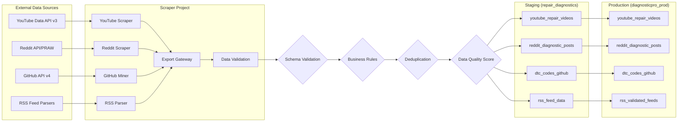
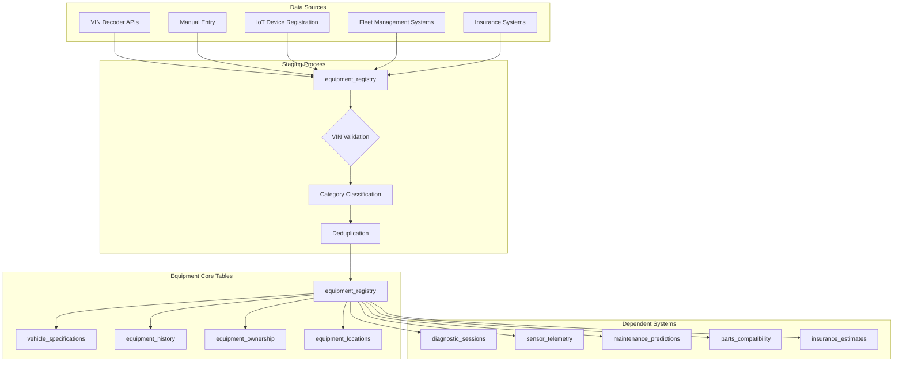
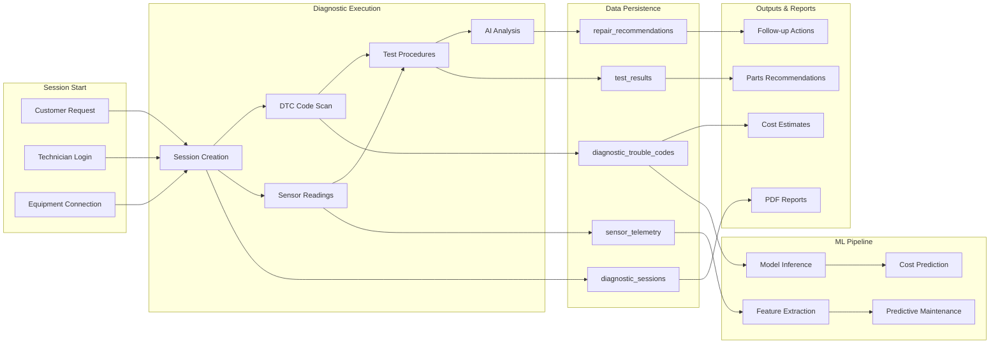
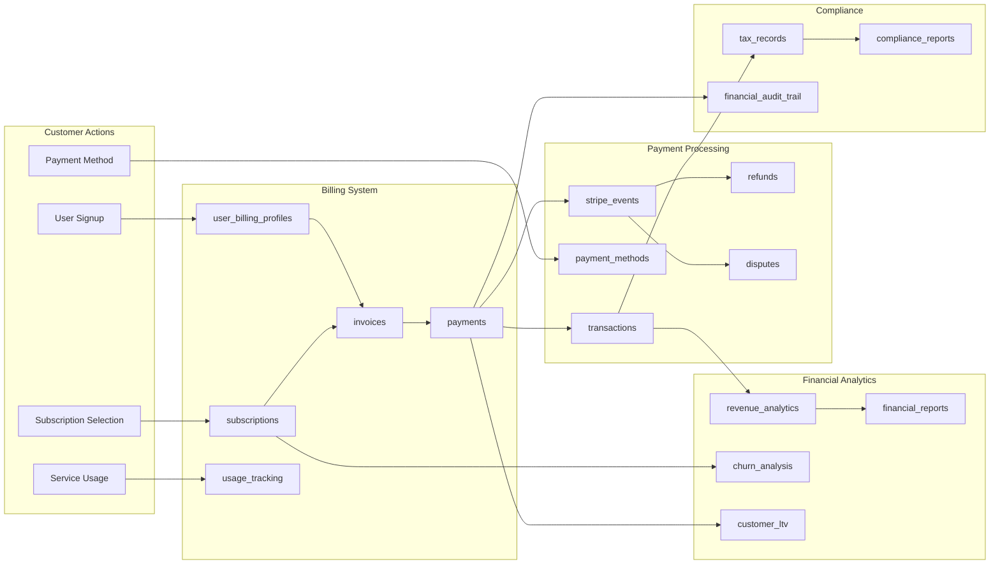
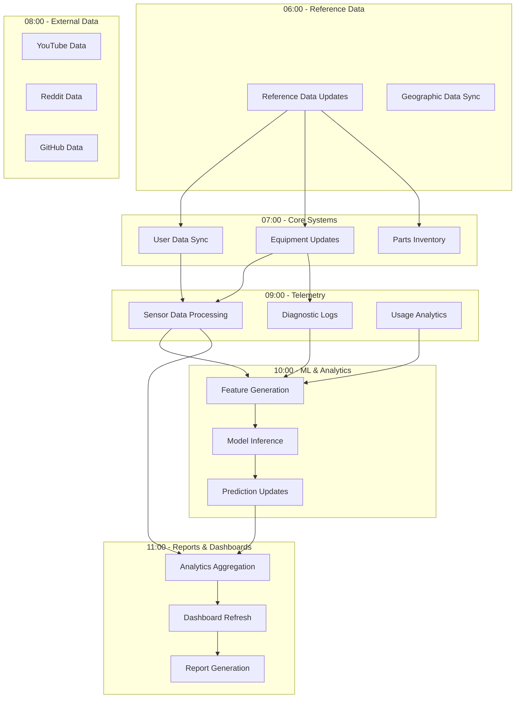
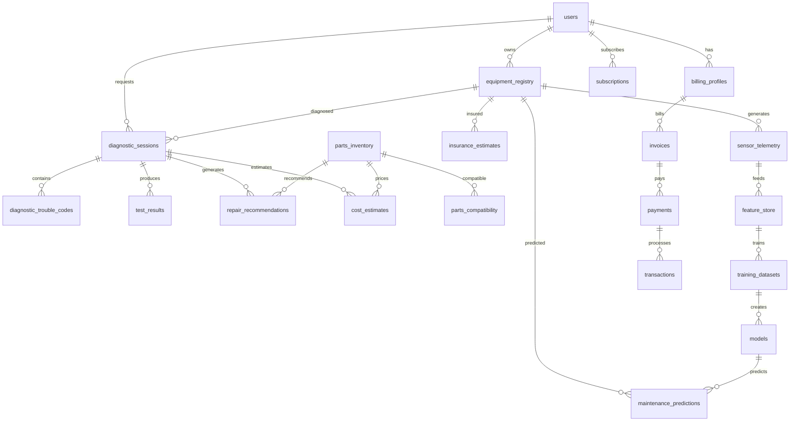

# S3 - Data Lineage Documentation
**Date:** 2025-09-16
**Version:** 3.0
**Project:** DiagnosticPro Platform
**BigQuery Project:** diagnostic-pro-start-up

---

## Overview

This document provides comprehensive data lineage mapping for the DiagnosticPro platform's data warehouse, covering 266+ production tables across multiple BigQuery datasets. It documents data flow from external sources through staging to production, including ML pipelines, analytics datasets, and archival processes.

## Architecture Summary

The DiagnosticPro platform follows a multi-layered data architecture:
- **Source Layer**: External data sources (YouTube, Reddit, GitHub, IoT sensors)
- **Staging Layer**: repair_diagnostics dataset for validation
- **Production Layer**: diagnosticpro_prod dataset (266+ tables)
- **Analytics Layer**: diagnosticpro_analytics for reporting
- **ML Layer**: diagnosticpro_ml for machine learning
- **Archive Layer**: diagnosticpro_archive for historical data

---

## 1. Top-Level Data Flow Diagram

```mermaid
graph TB
    %% External Sources
    subgraph "External Sources"
        YT[YouTube Videos]
        RD[Reddit Posts]
        GH[GitHub Repos]
        IOT[IoT Sensors]
        RSS[RSS Feeds]
        API[External APIs]
    end

    %% Staging Layer
    subgraph "Staging (repair_diagnostics)"
        STG_DTC[dtc_codes_github]
        STG_RED[reddit_diagnostic_posts]
        STG_YT[youtube_repair_videos]
        STG_EQ[equipment_registry]
        STG_SEN[sensor_telemetry]
        STG_DIAG[diagnostic_sessions]
        STG_PARTS[parts_inventory]
        STG_USERS[users]
    end

    %% Production Core
    subgraph "Production (diagnosticpro_prod) - 266 Tables"
        subgraph "Core Systems (47 tables)"
            PROD_USERS[users]
            PROD_EQ[equipment_registry]
            PROD_DIAG[diagnostic_sessions]
            PROD_PARTS[parts_inventory]
        end

        subgraph "Scraped Data (4 tables)"
            PROD_DTC[dtc_codes_github]
            PROD_RED[reddit_diagnostic_posts]
            PROD_YT[youtube_repair_videos]
            PROD_EQ_DATA[equipment_registry_data]
        end

        subgraph "Telemetry & ML (8 tables)"
            PROD_SEN[sensor_telemetry]
            PROD_FEAT[feature_store]
            PROD_MOD[models]
            PROD_PRED[maintenance_predictions]
        end
    end

    %% Analytics Layer
    subgraph "Analytics (diagnosticpro_analytics)"
        ANALYTICS_RPT[equipment_reports]
        ANALYTICS_DASH[diagnostic_dashboards]
        ANALYTICS_KPI[performance_kpis]
        ANALYTICS_AGG[aggregated_metrics]
    end

    %% ML Layer
    subgraph "ML (diagnosticpro_ml)"
        ML_TRAIN[training_datasets]
        ML_FEATURES[ml_features]
        ML_MODELS[model_registry]
        ML_PRED[prediction_results]
    end

    %% Archive Layer
    subgraph "Archive (diagnosticpro_archive)"
        ARCH_HIST[historical_data]
        ARCH_BACKUP[backup_snapshots]
    end

    %% Data Flow Connections
    YT --> STG_YT
    RD --> STG_RED
    GH --> STG_DTC
    IOT --> STG_SEN
    RSS --> STG_EQ
    API --> STG_USERS

    %% Staging to Production
    STG_DTC --> PROD_DTC
    STG_RED --> PROD_RED
    STG_YT --> PROD_YT
    STG_EQ --> PROD_EQ
    STG_SEN --> PROD_SEN
    STG_DIAG --> PROD_DIAG
    STG_PARTS --> PROD_PARTS
    STG_USERS --> PROD_USERS

    %% Production to Analytics
    PROD_EQ --> ANALYTICS_RPT
    PROD_DIAG --> ANALYTICS_DASH
    PROD_SEN --> ANALYTICS_KPI
    PROD_USERS --> ANALYTICS_AGG

    %% Production to ML
    PROD_SEN --> ML_FEATURES
    PROD_EQ --> ML_TRAIN
    PROD_DIAG --> ML_MODELS
    ML_MODELS --> ML_PRED

    %% Production to Archive
    PROD_USERS --> ARCH_HIST
    PROD_EQ --> ARCH_BACKUP

    %% Feedback Loops
    ML_PRED --> PROD_PRED
    ANALYTICS_KPI --> PROD_FEAT
```



---

## 2. Domain-Specific Lineage Diagrams

### 2.1 Scraped Data Lineage



### 2.2 Equipment Registry Lineage



### 2.3 Diagnostic Flow Lineage



### 2.4 ML Pipeline Lineage

```mermaid
graph TB
    %% Raw Data Sources
    subgraph "Raw Data Sources"
        SENSOR_RAW[sensor_telemetry]
        DIAG_RAW[diagnostic_sessions]
        EQUIP_RAW[equipment_registry]
        DTC_RAW[diagnostic_trouble_codes]
        PARTS_RAW[parts_inventory]
    end

    %% Feature Engineering
    subgraph "Feature Engineering"
        TIME_FEAT[Time-based Features]
        AGG_FEAT[Aggregated Features]
        ENCODE_FEAT[Encoded Features]
        DERIVED_FEAT[Derived Features]
    end

    %% Feature Store
    subgraph "Feature Store"
        FEAT_STORE[feature_store]
        FEAT_METADATA[feature_metadata]
        FEAT_LINEAGE[feature_lineage]
    end

    %% Model Training
    subgraph "Model Development"
        TRAIN_DATASETS[training_datasets]
        MODEL_TRAIN[Model Training]
        MODEL_VALID[Model Validation]
        MODEL_REG[models (registry)]
    end

    %% Inference Pipeline
    subgraph "Inference & Predictions"
        REAL_TIME[Real-time Inference]
        BATCH_PRED[Batch Predictions]
        MAINT_PRED[maintenance_predictions]
        COST_PRED[cost_predictions]
        RISK_SCORES[risk_assessments]
    end

    %% Monitoring & Feedback
    subgraph "Model Monitoring"
        DRIFT_MON[Drift Monitoring]
        PERF_MON[Performance Monitoring]
        FEEDBACK[Feedback Loop]
        MODEL_UPDATE[Model Updates]
    end

    %% Flow Connections
    SENSOR_RAW --> TIME_FEAT
    DIAG_RAW --> AGG_FEAT
    EQUIP_RAW --> ENCODE_FEAT
    DTC_RAW --> DERIVED_FEAT
    PARTS_RAW --> DERIVED_FEAT

    TIME_FEAT --> FEAT_STORE
    AGG_FEAT --> FEAT_STORE
    ENCODE_FEAT --> FEAT_STORE
    DERIVED_FEAT --> FEAT_STORE

    FEAT_STORE --> FEAT_METADATA
    FEAT_STORE --> FEAT_LINEAGE
    FEAT_STORE --> TRAIN_DATASETS

    TRAIN_DATASETS --> MODEL_TRAIN
    MODEL_TRAIN --> MODEL_VALID
    MODEL_VALID --> MODEL_REG

    MODEL_REG --> REAL_TIME
    MODEL_REG --> BATCH_PRED
    REAL_TIME --> MAINT_PRED
    BATCH_PRED --> COST_PRED
    BATCH_PRED --> RISK_SCORES

    MAINT_PRED --> DRIFT_MON
    COST_PRED --> PERF_MON
    RISK_SCORES --> FEEDBACK
    FEEDBACK --> MODEL_UPDATE
    MODEL_UPDATE --> MODEL_REG
```

### 2.5 Transaction Flow Lineage



---

## 3. Job Execution Order & Dependencies

### 3.1 Initial Population Sequence

```
Phase 1: Reference Data (No Dependencies)
├── reference_data
├── geographic_data
├── api_endpoints
└── error_codes

Phase 2: User & Authentication (Depends on Phase 1)
├── users
├── user_profiles
├── access_controls
└── api_keys_v2

Phase 3: Equipment Registry (Depends on Phase 1-2)
├── equipment_registry
├── vehicle_specifications
├── equipment_history
└── equipment_ownership

Phase 4: Core Business Tables (Depends on Phase 1-3)
├── diagnostic_sessions
├── parts_inventory
├── billing_profiles
└── subscriptions

Phase 5: Scraped Data (Independent, Parallel)
├── dtc_codes_github
├── reddit_diagnostic_posts
├── youtube_repair_videos
└── rss_feed_data

Phase 6: Telemetry & Time-Series (Depends on Phase 3-4)
├── sensor_telemetry
├── diagnostic_logs
├── usage_tracking
└── performance_metrics

Phase 7: ML & Analytics (Depends on Phase 3-6)
├── feature_store
├── models
├── maintenance_predictions
└── analytics_aggregates
```

### 3.2 Daily Refresh Dependencies



### 3.3 Real-time vs Batch Boundaries

**Real-time Processing (< 1 minute latency):**
- API access logs
- User authentication events
- Diagnostic session creation
- Payment transactions
- Critical system alerts
- IoT sensor readings (streaming)

**Near Real-time (1-15 minutes):**
- Diagnostic session updates
- Equipment status changes
- Notification delivery
- Usage tracking updates
- Model inference results

**Batch Processing (Hourly):**
- Scraped data validation
- Feature engineering
- Analytics aggregation
- Report generation
- Data quality checks

**Daily Batch Processing:**
- ML model training
- Historical data archival
- Compliance reports
- Data lineage updates
- Performance optimization

---

## 4. Data Quality Checkpoints

### 4.1 Validation Gates by Stage

```mermaid
graph LR
    %% Input Stage
    subgraph "Input Validation"
        SCHEMA_CHECK[Schema Validation]
        FORMAT_CHECK[Format Validation]
        ENCODING_CHECK[Encoding Check]
    end

    %% Staging Validation
    subgraph "Staging Validation"
        BIZ_RULES[Business Rules]
        REF_INTEGRITY[Referential Integrity]
        DUPLICATE_CHECK[Duplicate Detection]
        DATA_QUALITY[Data Quality Scoring]
    end

    %% Production Validation
    subgraph "Production Validation"
        CONSISTENCY_CHECK[Consistency Validation]
        COMPLETENESS[Completeness Check]
        FRESHNESS[Freshness Validation]
        ANOMALY_DETECT[Anomaly Detection]
    end

    %% Downstream Validation
    subgraph "Output Validation"
        LINEAGE_TRACK[Lineage Tracking]
        AUDIT_LOG[Audit Logging]
        COMPLIANCE_CHECK[Compliance Validation]
        PERF_MONITOR[Performance Monitoring]
    end

    %% Quality Gates
    QG1{Quality Gate 1<br/>Min Score: 0.9}
    QG2{Quality Gate 2<br/>Min Score: 0.8}
    QG3{Quality Gate 3<br/>Min Score: 0.95}
    QG4{Quality Gate 4<br/>Min Score: 0.99}

    %% Flow
    SCHEMA_CHECK --> FORMAT_CHECK --> ENCODING_CHECK --> QG1
    QG1 --> BIZ_RULES --> REF_INTEGRITY --> DUPLICATE_CHECK --> DATA_QUALITY --> QG2
    QG2 --> CONSISTENCY_CHECK --> COMPLETENESS --> FRESHNESS --> ANOMALY_DETECT --> QG3
    QG3 --> LINEAGE_TRACK --> AUDIT_LOG --> COMPLIANCE_CHECK --> PERF_MONITOR --> QG4
```



### 4.2 SLA Monitoring Points

| **Dataset** | **Table Type** | **Freshness SLA** | **Quality SLA** | **Availability SLA** |
|-------------|----------------|-------------------|-----------------|---------------------|
| repair_diagnostics | Staging | < 1 hour | > 90% | 99.5% |
| diagnosticpro_prod | Core Tables | < 4 hours | > 95% | 99.9% |
| diagnosticpro_prod | Time Series | < 15 minutes | > 90% | 99.5% |
| diagnosticpro_analytics | Aggregates | < 24 hours | > 98% | 99.0% |
| diagnosticpro_ml | Features | < 2 hours | > 92% | 99.5% |
| diagnosticpro_ml | Models | < 72 hours | > 99% | 99.9% |

### 4.3 Quality Rules from S2

**Critical Validation Rules:**
- UUID format validation: `^[a-f0-9]{8}-[a-f0-9]{4}-[a-f0-9]{4}-[a-f0-9]{4}-[a-f0-9]{12}$`
- DTC code format: `^[PBCU]\d{4}$`
- VIN format: `^[A-HJ-NPR-Z0-9]{17}$`
- Email format: `^[a-zA-Z0-9._%+-]+@[a-zA-Z0-9.-]+\.[a-zA-Z]{2,}$`
- Timestamp validation: not_future, not_before_created
- Foreign key integrity checks
- Business rule compliance (see S2_quality_rules.yaml)

---

## 5. Table Dependencies & Relationships

### 5.1 Foreign Key Relationships



### 5.2 Logical Join Dependencies

**Core Business Joins:**
```sql
-- Equipment Diagnostic Summary
equipment_registry e
JOIN diagnostic_sessions ds ON e.id = ds.equipment_id
JOIN diagnostic_trouble_codes dtc ON ds.session_id = dtc.session_id
JOIN repair_recommendations rr ON ds.session_id = rr.session_id

-- Customer Billing Summary
users u
JOIN billing_profiles bp ON u.id = bp.user_id
JOIN subscriptions s ON u.id = s.user_id
JOIN invoices i ON bp.id = i.billing_profile_id
JOIN payments p ON i.id = p.invoice_id

-- ML Feature Pipeline
equipment_registry e
JOIN sensor_telemetry st ON e.id = st.equipment_id
JOIN feature_store fs ON e.id = fs.entity_id
JOIN maintenance_predictions mp ON e.id = mp.equipment_id
```

### 5.3 Aggregation Dependencies

**Daily Aggregations:**
- equipment_reports ← equipment_registry + diagnostic_sessions + sensor_telemetry
- usage_analytics ← diagnostic_sessions + sensor_telemetry + api_access_log
- revenue_analytics ← payments + subscriptions + usage_tracking
- performance_metrics ← sensor_telemetry + diagnostic_sessions + response_times

**Weekly Aggregations:**
- customer_ltv ← payments + subscriptions + diagnostic_sessions + duration
- equipment_health_scores ← sensor_telemetry + maintenance_predictions + diagnostic_sessions
- technician_performance ← diagnostic_sessions + customer_feedback + resolution_times

**Monthly Aggregations:**
- churn_analysis ← subscriptions + usage_tracking + customer_support_tickets
- parts_demand_forecast ← repair_recommendations + parts_inventory + diagnostic_sessions
- fleet_optimization_metrics ← equipment_registry + sensor_telemetry + maintenance_predictions

---

## 6. Performance Optimization Patterns

### 6.1 Partitioning Strategy

**Date-based Partitioning:**
- sensor_telemetry: `PARTITION BY reading_date`
- diagnostic_sessions: `PARTITION BY session_date`
- feature_store: `PARTITION BY feature_date`
- api_access_log: `PARTITION BY DATE(created_at)` + 90-day expiration

**No Partitioning (Reference Tables):**
- users, equipment_registry, parts_inventory
- reference_data, geographic_data, api_endpoints

### 6.2 Clustering Strategy

**High-Cardinality Clustering:**
- equipment_registry: `CLUSTER BY equipment_category, manufacturer`
- sensor_telemetry: `CLUSTER BY equipment_id, sensor_id`
- diagnostic_sessions: `CLUSTER BY equipment_id, session_type`

**Status-based Clustering:**
- users: `CLUSTER BY user_type, is_active`
- subscriptions: `CLUSTER BY status, user_id`
- payments: `CLUSTER BY status, created_at`

### 6.3 Query Optimization Patterns

**Require Partition Filters:**
- All time-series tables require date range filters
- Enforced through BigQuery settings and query validation

**Materialized Views:**
- Daily equipment summaries
- Real-time diagnostic dashboards
- Customer usage aggregates

---

## 7. Compliance & Governance

### 7.1 Data Lineage Tracking

All data transformations are tracked with:
- Source system identification
- Transformation timestamps
- Data quality scores
- Processing pipeline metadata
- User access audit trails

### 7.2 Retention Policies

| **Data Category** | **Retention Period** | **Archive Strategy** |
|-------------------|---------------------|---------------------|
| User PII | 7 years after account closure | Encrypted archive |
| Financial Data | 10 years | Compliance archive |
| Diagnostic Sessions | 7 years | Compressed archive |
| Sensor Telemetry | 2 years active, 5 years archive | Time-based partitioning |
| ML Training Data | 3 years | Model-versioned archive |
| Audit Logs | 10 years | Write-once archive |
| System Logs | 90 days | Auto-expiration |

### 7.3 Privacy & Security

**PII Data Flow:**
- Identified in S2_quality_rules.yaml
- Encrypted at rest and in transit
- Access logged and monitored
- Anonymization rules applied for analytics

**Data Classification:**
- Public: Reference data, API documentation
- Internal: Aggregated analytics, system metrics
- Confidential: Customer data, financial records
- Restricted: PII, payment information, diagnostic details

---

## 8. Monitoring & Alerting

### 8.1 Data Quality Alerts

**Critical Alerts (Immediate):**
- Schema validation failures > 1%
- Foreign key violations > 0.1%
- Data freshness delays > 4 hours (core tables)
- Model inference failures > 5%

**Warning Alerts (15 minutes):**
- Data quality scores < 0.8
- Duplicate detection > 10%
- Partition expiration issues
- Query performance degradation

### 8.2 Operational Alerts

**Pipeline Health:**
- Batch job failures
- Streaming lag > 15 minutes
- Resource quota utilization > 80%
- Error rate increases > 10%

**Business Impact:**
- Revenue-impacting table failures
- Customer-facing service dependencies
- Compliance violation risks
- SLA breach thresholds

---

**Document Version:** 3.0
**Last Updated:** 2025-09-16
**Next Review:** 2025-10-16
**Owner:** Database Schema Architecture Team
**Stakeholders:** Data Engineering, ML Engineering, Analytics, Compliance

---

*This lineage documentation is automatically updated with each schema deployment and validated against the production environment daily.*